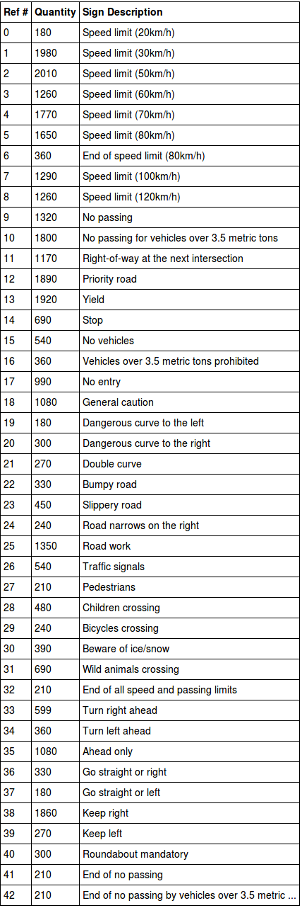

## Project 2 - Traffic Sign Classifier
### Project Goals
- Load the data set (see below for links to the project data set)
- Explore, summarize and visualize the data set
- Design, train and test a model architecture
- Use the model to make predictions on new images
- Analyze the softmax probabilities of the new images
- Summarize the results with a written report

---

### Dataset Vizualization and Summary

The dataset provided for training, validation, and testing was massive. The training set alone contained 34799 samples. The library numpy was utilized to determine the lengths of each data set, as well as the shape of the items in the sets:

- Training set: 34799 images
- Validation set: 4410 images
- Test set: 12630 images
- Image shape: 32 X 32 pixels, 3 color channels
- Unique sign classes: 43

Below is a table relating the label and reference number for each sign to the quantity of each type present in the data set, generated by the pandas module:

### Model Architecture

#### Preprocessing

#### Final Model

#### Training

#### Results

My final model results were:
- Training set accuracy of 0.995
- Validation set accuracy of 0.949
- Test set accuracy of 0.915

### New Images

#### Data Set

Below are the 5 additional German traffic signs found on the web:

  
 

#### Prediction Accuracy

The model was only able to correctly guess 2 of the 5 traffic signs, with an accuracy of 40%. This is radically different from the results of the test set, which were 91.5%. This discrepancy could be attributed to the formatting and cropping the web found images underwent before the preproccessing pipeline in this project. It is also possible that the model is used to images with real-world backgrounds, as apposed to single color backgrounds.
