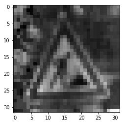
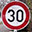
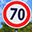

## Project 2 - Traffic Sign Classifier
### Project Goals
- Load the data set (see below for links to the project data set)
- Explore, summarize and visualize the data set
- Design, train and test a model architecture
- Use the model to make predictions on new images
- Analyze the softmax probabilities of the new images
- Summarize the results with a written report

---

### Dataset Vizualization and Summary

The dataset provided for training, validation, and testing was massive. The training set alone contained 34799 samples. The library numpy was utilized to determine the lengths of each data set, as well as the shape of the items in the sets:

- Training set: 34799 images
- Validation set: 4410 images
- Test set: 12630 images
- Image shape: 32 X 32 pixels, 3 color channels
- Unique sign classes: 43

Below is a table relating the label and reference number for each sign to the quantity of each type present in the data set, generated by the pandas module:

### Model Architecture

#### Preprocessing

The first step in my preprocessing routine is to convert the images to grayscale. This reduces the image size from 32X32X3 to 32X32X1. Removing 2 color channels reduces the size of the inputs to the overall model.

Next, the values of each pixel in each image is normalized to be between -1 and 1, with 0 as the center. For example, a pixel with value 156 would be normalized to approximately .219. This normalization allows the model to traverse shorter distances when training. Below is an image from the data set after grayscale conversion and normalization:

During testing, I attempted to add additional data to the training set by making several copies of each image and rotating it by a random angle for each copy. I was successfully able to double and triple the data set, but with adverse effect on my machine's performance and memory utilization. The code was omitted for the final run, but could be reimplemented to run on a more powerful machine. The process for rotating images and adding them to the training set can be found in cell 6 of the notebook.

#### Final Model

The final deep learning model used was a slight modification of the LeNet architecture. The LeNet model was chosen because it performed admirably without modification or preprocessing during an initial trial run against the testing set. It continued to perform well after preprocessing was implemented, but still was unable to deliver validation accuracy over 91%. Because of this, a dropout layer was inserted between the second convolutional layer and the first fully connected layer. For training, the dropout probability was set to 0.75.

#### Training

#### Results

My final model results were:
- Training set accuracy of 0.995
- Validation set accuracy of 0.949
- Test set accuracy of 0.915

### New Images

#### Data Set

Below are the 5 additional German traffic signs found on the web:

  
 

#### Prediction Accuracy

The model was only able to correctly guess 2 of the 5 traffic signs, with an accuracy of 40%. This is radically different from the results of the test set, which were 91.5%. This discrepancy could be attributed to the formatting and cropping the web found images underwent before the preproccessing pipeline in this project. It is also possible that the model is used to images with real-world backgrounds, as apposed to single color backgrounds.

#### Prediction Certainty
