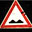

## Project 2 - Traffic Sign Classifier
### Project Goals
- Load the data set (see below for links to the project data set)
- Explore, summarize and visualize the data set
- Design, train and test a model architecture
- Use the model to make predictions on new images
- Analyze the softmax probabilities of the new images
- Summarize the results with a written report

---

### Dataset Vizualization and Summary

The dataset provided for training, validation, and testing was massive. The training set alone contained 34799 samples. The library numpy was utilized to determine the lengths of each data set, as well as the shape of the items in the sets:

- Training set: 34799 images
- Validation set: 4410 images
- Test set: 12630 images
- Image shape: 32 X 32 pixels, 3 color channels
- Unique sign classes: 43

Below is a table relating the label and reference number for each sign to the quantity of each type present in the data set, generated by the pandas module:

### Model Architecture

#### Preprocessing

The first step in my preprocessing routine is to convert the images to grayscale. This reduces the image size from 32X32X3 to 32X32X1. Removing 2 color channels reduces the size of the inputs to the overall model.

Next, the values of each pixel in each image is normalized to be between -1 and 1, with 0 as the center. For example, a pixel with value 156 would be normalized to approximately .219. This normalization allows the model to traverse shorter distances when training. Below is an image from the data set after grayscale conversion and normalization:

During testing, I attempted to add additional data to the training set by making several copies of each image and rotating it by a random angle for each copy. I was successfully able to double and triple the data set, but with adverse effect on my machine's performance and memory utilization. The code was omitted for the final run, but could be reimplemented to run on a more powerful machine. The process for rotating images and adding them to the training set can be found in cell 6 of the notebook.

#### Final Model and Training

The final deep learning model used was a slight modification of the LeNet architecture. The LeNet model was chosen because it performed admirably without modification or preprocessing during an initial trial run against the testing set. It continued to perform well after preprocessing was implemented, but still was unable to deliver validation accuracy over 91%. Because of this, a dropout layer was inserted between the second convolutional layer and the first fully connected layer. For training, the dropout probability was set to 0.75.

By modifying the sigma value, I was able to reduce the variation of the randomly defined weights and biases. I iterated down from 0.1 to 0.075, and finally to 0.05. With the last value, I found that because there was smaller variation between the starting values, the model was able to reach over 90% accuracy in fewer epochs. That being said, in some later epochs, I noticed the accuracy declining. It is possible that starting with the low sigma value caused the model to be over fit to the training set.

Additionally, I initially tried between 15 and 20 epochs, but saw a similar result as reported earlier: the accuracy began to decrease or stay near the same, possibly due to over fitting. Over fitting might also have been a problem due to the size of my training set. Because I did not add additional data for the last run, the model had fewer examples to train on, it is possible that the model became "used to" the images.

For the final model, I used a learning rate of 0.001. During training, I modified this value to 0.002, but experience the same "over fitting" problem, though in a less pronounced way. Because my "step" between epochs was double the initial value, it is possible that it stepped past a minimum. Finally, I used the batch size of 128. As I performed testing on my local machine, this batch size allowed the model to run without much incident. As I had earlier memory difficulty with enlarging my training set, I did not increase the size of the batches being processed.

My final model consisted of the following layers:

| Layer         		    | Description	        					                          |
|-----------------------|---------------------------------------------------------|
| Input         		    | 32x32x3 Grayscale image   							                |
| Convolution 1 	      | 5x5 filter, 1x1 stride, valid padding, outputs 28x28x6 	|
| RELU 1        				|												                                  |
| Max Pooling	1      	  | 2x2 stride,  outputs 14x14x6                      			|
| Convolution 2         | 5x5 filter, 1x1 stride, valid padding, outputs 10x10x16 |
| RELU 2        				|												                                  |
| Max Pooling	2      	  | 2x2 stride,  outputs 5x5x16                      			  |
| Flatten 1             | 5x5x16 flattened to 400                                 |
| Dropout 1             | Keep probability 0.75 for training, 1.0 for validation  |
| Fully Connected 1     | Outputs 120                                             |
| RELU 3                |                                                         |
| Fully Connected 2     | Outputs 84                                              |
| RELU 4                |                                                         |
| Fully Connected 3     | Outputs 43 (Number of Classes)                          |

#### Results

My final model results were:
- Training set accuracy of 0.995
- Validation set accuracy of 0.949
- Test set accuracy of 0.915

### New Images

#### Data Set

Below are the 5 additional German traffic signs found on the web:

  
 

#### Prediction Accuracy

The model was only able to correctly guess 2 of the 5 traffic signs, with an accuracy of 40%. This is radically different from the results of the test set, which were 91.5%. This discrepancy could be attributed to the formatting and cropping the web found images underwent before the preproccessing pipeline in this project. It is also possible that the model is used to images with real-world backgrounds, as apposed to single color backgrounds.

Here are the results of the prediction:

| Image			            | Prediction	        					|
|-----------------------|-------------------------------|
| 30 km/hr      		    | 30 km/hr  								  	|
| 70 km/hr  			      | 30 km/hr					  			    |
| Stop Sign 	        	| No Passing		  					    |
| No Passing	     		  | Stop Sign  					 				  |
| Bumpy Road  			    | Bumpy Road        					  |

Upon review of the output, it appears that the order of outputs from cell 10 to cell 11 was changed. The two images that switched places actually were predicted to be the other sign. It is possible that the application of the other sign's label was an accident, making the testing accuracy 80% instead of 40%.

#### Prediction Certainty

In the first image, the model is nearly completely certain that it is a 30 km/hr sign (probability of .99). The top five soft max probabilities were:

| Probability         	|     Prediction	        					|
|-----------------------|-----------------------------------|
| .99         			    | 30 km/hr         									|
| .00042     			  	  | 50 km/hr 			      							|
| .00012					      | 20 km/hr    											|
| .0000052    			    | 80 km/hr  					      				|
| .00000036		          | End of Speed Limit   							|

In the second image, the model is nearly completely certain that it is a 30 km/hr sign (probability of .96). Unfortunately, it was incorrect. The top five soft max probabilities were:

| Probability         	|     Prediction	        					|
|-----------------------|-----------------------------------|
| .96         			    | 30 km/hr         									|
| .033       			  	  | 80 km/hr			      							|
| .0058					        | 70 km/hr    											|
| .00029      			    | Roundabout Mandatory       				|
| .00016     	          | No Passing for Large Vehicles  		|

In the third image, the model is very uncertain, with the top prediction being a Stop Sign (probability of .32). The top five soft max probabilities were:

| Probability         	|     Prediction	        					|
|-----------------------|-----------------------------------|
| .32         			    | Stop Sign         								|
| .25        				    | Keep Right		      							|
| .16   					      | 120 km/hr    											|
| .14        			      | 80 km/hr  					      				|
| .034    		          | Go Straight or Right							|

In the fourth image, the model is nearly completely certain that it is a No Passing sign (probability of .99). The top five soft max probabilities were:

| Probability         	|     Prediction	        					|
|-----------------------|-----------------------------------|
| .99         			    | No Passing       									|
| .0094      			  	  | Dangers Curve to Right  					|
| .0002					        | End of No Passing 								|
| .0000057    			    | Go Straight or Right 		  				|
| .0000035 		          | Roundabout Mandatory  						|

In the fifth image, the model is mostly certain that it is a Bumpy Road sign (probability of .74). The top five soft max probabilities were:

| Probability         	|     Prediction	        					|
|-----------------------|-----------------------------------|
| .74         			    | Bumpy Road       									|
| .13        				    | Wild Animal Crossing			      	|
| .082 					        | Traffic Signals   								|
| .022       			      | General Caution 		      				|
| .013	                | 10 km/hr             							|
